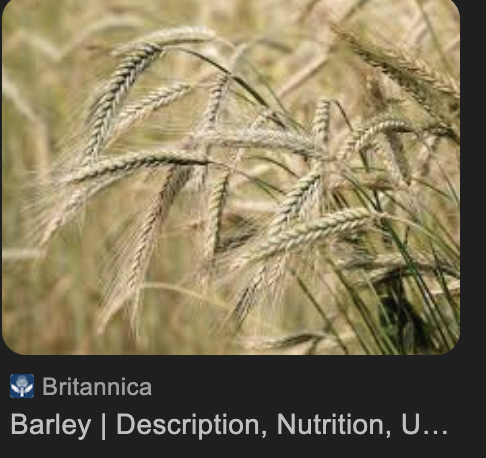

# Literature Review — *Predicting plant biomass accumulation from image-derived parameters*  
**Chen et al., GigaScience (2018)**

## High-level takeaway

- ❌ **NO direct organ-level biomass data**
- ❌ **NOT a tomato paper**
- ✅ **VERY strong for image-to-biomass prediction (based on extracted features)**
- ✅ **Strong evidence that simple RGB shape features are not enough; physiological/image-intensity features also help**
- ✅ **Useful methodological template for our agrifood project**
- ⚠️ **Indirectly useful for tomato organ biomass estimation, but you must build the organ-level mapping yourself**
- ⚠️ **This paper predicts whole-shoot biomass, not leaf/stem/fruit biomass separately**

---

## 1) What this paper is about

This paper asks a pretty practical question:

> Can we predict plant biomass accurately from non-destructive image-derived traits instead of harvesting plants and weighing them?

The authors use **barley**, not tomato, and they combine image-based traits from multiple imaging modalities with machine learning models to predict **fresh weight (FW)** and **dry weight (DW)**. Their main conclusion is that **random forest (RF)** gives the best overall performance among the tested models.

So this paper is not mainly about segmentation or organ classification. It is mainly about **biomass regression from image-derived phenotypic features**.

---

## 2) Why this paper matters

Biomass is usually measured destructively, which is slow and prevents repeated measurement of the same plant over time. This paper is valuable because it shows that image-based phenotyping can serve as a practical surrogate for destructive biomass measurement, especially when multiple feature types are combined.

What is especially useful here is that the authors do **not** rely only on one shape proxy like projected area or digital volume. They show that biomass is better captured when you include both:

- **structural/geometric features**
- **physiological or density-related image features**, especially **NIR** and **fluorescence-related** information

That is a big idea you can carry straight into your tomato work.

---

## 3) Core methodology

### 3.1 Pipeline
The pipeline is basically:

1. Acquire plant images
2. Extract image-derived traits
3. Group traits into categories
4. Remove bad/redundant traits
5. Train regression models
6. Predict biomass
7. Compare predicted vs measured biomass

### 3.2 Biomass targets
The paper predicts:

- **Fresh weight (FW)**
- **Dry weight (DW)**

Important limitation: this is **above-ground shoot biomass**, not organ-specific biomass.

### 3.3 ML models tested
They compare 4 models:

- **MLR** — multivariate linear regression
- **MARS** — multivariate adaptive regression splines
- **RF** — random forest
- **SVR** — support vector regression

Their conclusion is that **RF slightly outperformed the other methods overall**, especially for control plants and in terms of feature interpretability.

### 3.4 Validation
They used:

- **10-fold cross-validation**
- repeated **10 times**
- plus **cross-experiment validation**
- plus **cross-treatment validation**

This is actually one of the stronger parts of the paper, because they do not just show “it works on one dataset.”

---

## 4) Data and experimental design

### 4.1 Species
- **Barley (Hordeum vulgare)**

### 4.2 Experimental setup
- **3 consecutive experiments**
- **312 plants per experiment**
- **18 genotypes**
- **2 treatments**:
  - well-watered control
  - drought stress
- duration:
  - **58 days** per experiment

### 4.3 Imaging setup
Plants were phenotyped using a **LemnaTec Scanalyzer 3D** system.

### 4.4 Imaging modalities
They used 3 sensor types:

- **Visible / color**
- **Fluorescence (FLUO)**
- **Near-infrared (NIR)**

### 4.5 Trait categories
Traits were grouped into 4 categories:

- **Geometric**
- **Color-related**
- **FLUO-related**
- **NIR-related**

This is very relevant for your project because it shows that biomass prediction is not only about geometry.

---

## 5) Main findings

## 5.1 Biomass can be predicted well from image-derived parameters
This is the paper’s main result.

They show that image-derived traits can predict biomass quite accurately, and that combining many traits works better than relying on only one simple feature like digital volume.

### Why this matters
A lot of earlier work used projected area or digital volume as a proxy. This paper argues that biomass is more complex than that.

---

## 5.2 Random forest was the best overall model
Among MLR, MARS, RF, and SVR, **RF performed best overall**.

The authors emphasize 3 reasons RF is especially useful:

1. better predictive power
2. better than single-feature models
3. easier biological interpretation through feature importance

### Interpretation
This means that if your future tomato biomass pipeline needs a first “strong baseline,” **RF is a very reasonable starting point**.

---

## 5.3 Geometric features matter most — but not alone
The strongest predictors were still geometric features such as:

- **projected area**
- **digital volume**
- border/shape-related descriptors

But the important thing is: **geometry alone was not the whole story**.

The paper also found strong contributions from:

- **NIR intensity**
- **FLUO intensity**
- some **color-related features**

That suggests biomass is tied not just to visible size, but also to image-derived signals related to plant density, water content, and physiological status.

### Why this is important for you
For tomato organ biomass, a segmentation mask gives organ area/shape, but that may still be insufficient for accurate biomass. You may eventually need:

- RGB shape features
- texture
- intensity statistics
- maybe multispectral/NIR if available
- view-based or 3D cues

---

## 5.4 Fresh weight and dry weight are not explained by exactly the same features
This is one of the more interesting findings.

The relative importance of features for **FW** and **DW** was correlated, but **not identical**.

Examples the paper highlights as differing between FW and DW include:

- `nir.intensity`
- `compactness.01`
- `hull.pc1`
- `leaf.count`
- `hsv.h.average`
- `lab.a.mean`

### Interpretation
That makes biological sense:

- **FW** is more sensitive to water-related properties
- **DW** is more about actual dry matter accumulation

So for tomato biomass work, you need to be clear whether your target is closer to:

- fresh biomass,
- dry biomass,
- or organ dry matter accumulation

Because the best image features may differ.

---

## 5.5 Cross-experiment transfer works, but only under similar conditions
This paper is better than many simple benchmark papers because it checks **generalization across experiments**.

They found:

- very high performance **within experiment**
- still pretty good performance **across experiments 1 and 2**
- noticeably worse performance involving **experiment 3**

The authors attribute the weaker performance partly to **seasonal differences** like temperature and illumination.

### Important lesson
A biomass model may look great on one dataset but degrade when:

- lighting changes
- season changes
- plant behavior changes
- image quality shifts
- treatment distributions shift

This is super relevant for your project. If you build a tomato organ biomass estimator from one greenhouse batch, it may not generalize well to another greenhouse, growth stage, or camera setup unless you standardize conditions or train more broadly.

---

## 5.6 Cross-treatment transfer is weak
A very important caution from the paper:

Models trained on **control plants** did **not** transfer well to **stressed plants**, and vice versa.

The authors suggest one reason is image quality differences, since smaller stressed plants may be easier to image with less overlap/out-of-range area.

### Why this matters for you
If your tomato system eventually includes:

- healthy vs stressed plants
- different nutrient regimes
- drought/heat conditions
- different canopy densities

then a single model may not generalize unless the training set includes those conditions.

---

## 6) Strengths of the paper

## 6.1 Strong regression framing
The paper is very clear that this is a **quantitative biomass prediction** problem, not just descriptive phenotyping.

## 6.2 Multiple imaging modalities
Using visible + FLUO + NIR makes the paper stronger than works that only use projected area from RGB.

## 6.3 Comparison across models
They do not just use one ML method. They compare four.

## 6.4 Feature importance analysis
This is very useful because it tells you **which image-derived signals matter most**, not just whether a model works.

## 6.5 Cross-experiment evaluation
This is a major plus. It makes the conclusions more realistic.

---

## 7) Weaknesses / limitations

## 7.1 Not organ-level
This is the biggest limitation for your project.

The paper predicts **whole-shoot biomass**, not:

- leaf biomass
- stem biomass
- fruit biomass
- root biomass

So it does **not** solve the exact problem you care about.

## 7.2 Not tomato

Barley architecture is very different from tomato architecture.

Tomato has:

- more branching complexity
- fruit organs
- different stem/leaf visual structure
- more overlap/occlusion issues in many settings

So transfer of specific features is not guaranteed.

## 7.3 Feature-engineered, not segmentation-driven
This is more of a classical phenotyping + ML paper.

It does **not** do:

- organ segmentation
- semantic segmentation
- instance segmentation
- deep learning-based mask extraction

That means it is missing the exact front-end your project needs.

## 7.4 Mostly last-day traits
The paper uses representative traits from the final growth day for prediction. That is fine for the study design, but it is less directly about dynamic organ tracking over time.

## 7.5 Dependence on imaging conditions
The cross-experiment degradation shows the model depends on consistent conditions.

---

## 8) Relation to your agrifood project

Your project goal is roughly:

1. **classify/segment different organs of tomato plants**
2. **estimate biomass from images**

This paper helps mostly with **step 2**, and only indirectly.

### What it gives you
It strongly supports the idea that:

- image-derived features can predict biomass
- biomass is not determined only by organ size/area
- combining multiple feature types is better than single-feature proxies
- random forest is a strong baseline for biomass prediction
- generalization must be tested across experiments/conditions

### What it does *not* give you
It does **not** give you:

- tomato organ masks
- leaf/stem/fruit labels
- organ-specific biomass labels
- a direct mapping from segmented organs to organ biomass

### So how it fits your pipeline
A realistic tomato pipeline inspired by this paper would be:

1. **Segment tomato organs**  
   leaf / stem / fruit / maybe flower

2. **Extract organ-wise features**  
   area, perimeter, compactness, aspect ratio, color stats, texture, maybe 3D/multi-view cues, maybe NIR if available

3. **Train biomass regressors**  
   leaf biomass, stem biomass, fruit biomass, total biomass

4. **Validate across experiments and stress conditions**  
   because this paper shows transfer is a real problem

### My blunt judgment
This paper is:

- **very relevant conceptually**
- **moderately relevant methodologically**
- **not directly sufficient for your final goal**

So I’d classify it like this:

- **For organ classification/segmentation:** low direct usefulness  
- **For biomass prediction modeling:** high usefulness  
- **For tomato-specific organ biomass estimation:** indirect but important

---

## 9) What they used

## 9.1 Hardware / equipment
- **LemnaTec Scanalyzer 3D** automated phenotyping/imaging platform
- sensor types:
  - **visible/color camera**
  - **fluorescence camera**
  - **near-infrared camera**

### Pixel / resolution
- **Not clearly specified in this paper**
- so I cannot honestly tell you the exact image resolution from the text provided

## 9.2 Software
- **IAP software (Integrated Analysis Platform), version 1.1.2**
- used for image processing and trait extraction

## 9.3 Programming / analysis stack
- **R** (release 2.15.2)

## 9.4 Packages / methods mentioned
- base `lm` for MLR
- `earth` package for MARS
- `randomForest` package for RF
- `e1071` package for SVR / LIBSVM interface

## 9.5 Data processing choices
- missing values filled using mean of replicated plants
- feature normalization by dividing each column by its max value
- representative nonredundant feature selection
- common feature set used for cross-dataset prediction

---

## 10) Dataset and code availability

## Code
- **Project:** *Modeling of plant biomass accumulation with HTP data*
- **GitHub:** `https://github.com/htpmod/HTPmod`
- **Language:** R
- **License:** GNU GPL v3.0

## Data
The paper says raw image datasets and analyzed data are available in the **PGP repository** under these DOIs:

- `https://dx.doi.org/10.5447/IPK/2017/24`
- `https://dx.doi.org/10.5447/IPK/2017/25`
- `https://dx.doi.org/10.5447/IPK/2017/26`

Also mentioned:

- **GigaDB supporting dataset:** `http://dx.doi.org/10.5524/100392`

### Important note
These are **barley biomass phenotyping datasets**, not tomato organ-biomass datasets.

---

## 11) Best reusable ideas from this paper for your own work

If I were adapting this paper to your tomato problem, I would keep these ideas:

### 11.1 Use segmentation first, then regression
Because your target is organ-specific biomass, first isolate organs, then compute organ-wise features.

### 11.2 Do not rely only on organ area
This paper strongly suggests biomass is not just projected area.

### 11.3 Include physiological/intensity-style features if possible
If your data are only RGB, use at least:
- mean/std color
- HSV/Lab statistics
- texture
- compactness
- border/shape descriptors

If you later gain multispectral/NIR, even better.

### 11.4 Start with random forest as baseline
Before jumping straight to a huge deep model, RF gives a strong interpretable baseline.

### 11.5 Validate across batches/conditions
Do not trust same-dataset performance only.

---

## 12) Final verdict for your project

## Overall relevance
**Moderately high relevance**

## Why
Because it gives a strong and practical framework for **biomass prediction from image-derived features**, which is one half of your problem.

## But
It does **not** solve the harder front-end problem of **tomato organ segmentation/classification**, and it does **not** provide organ-level biomass labels.

## My final classification
- **Direct use for tomato organ segmentation:** ⭐⭐☆☆☆
- **Direct use for biomass regression methodology:** ⭐⭐⭐⭐☆
- **Direct use for tomato organ biomass estimation:** ⭐⭐☆☆☆
- **Conceptual usefulness for your full pipeline:** ⭐⭐⭐⭐☆

---

## 13) One-sentence takeaway

This paper is a **strong reference for the biomass-estimation half of your tomato pipeline**, showing that multi-feature image phenotyping plus random forest can predict biomass well, but you will still need a separate **organ segmentation + organ-level labeling strategy** to make it truly fit your tomato agrifood project.

## MY Q&A with GPT:

> *Can i use its code directly to estimate tomato whole mass? i mean its ok if we dont do segmentation right? but i would assume it would be less accurate since it is not uniform?*

## Can you use this paper’s code directly for tomato biomass?

### Short answer
- ❌ **Directly use their trained model → NO**
- ✅ **Reuse their pipeline/idea → YES**

---

## Why not directly?

- Trained on **barley**, not tomato  
- Uses **specific imaging setup (RGB + FLUO + NIR)**  
- Paper shows even **barley → barley transfer can degrade across conditions**

👉 So tomato = distribution shift → model won’t generalize well

---

## Can you skip segmentation?

### For whole-plant biomass:
- ✅ **Yes, valid (this paper does that)**
- ⚠️ **Accuracy may be lower**

---

## Why less accurate (your intuition is correct)

Tomato is:
- less uniform than barley
- has **fruit (huge mass contribution)**
- more **occlusion + branching**

👉 One global feature vector = harder to model

---

## What you should actually do

### 🔥 MVP (fastest)
1. Use whole plant images
2. Extract features:
   - area, height, width
   - shape (perimeter, compactness)
   - color stats (RGB / HSV)
3. Train model:
   - Random Forest (best baseline)
4. Predict **total biomass**

---

### 🚀 Better version (later)
1. Segment organs (leaf / stem / fruit)
2. Extract features per organ
3. Predict:
   - leaf biomass
   - stem biomass
   - fruit biomass
4. Sum → total biomass

---

## Final verdict

- ✅ Use their **method**
- ❌ Don’t use their **trained model**
- ✅ Skipping segmentation is fine for MVP
- ⚠️ But for tomato → **segmentation will matter a lot later**
