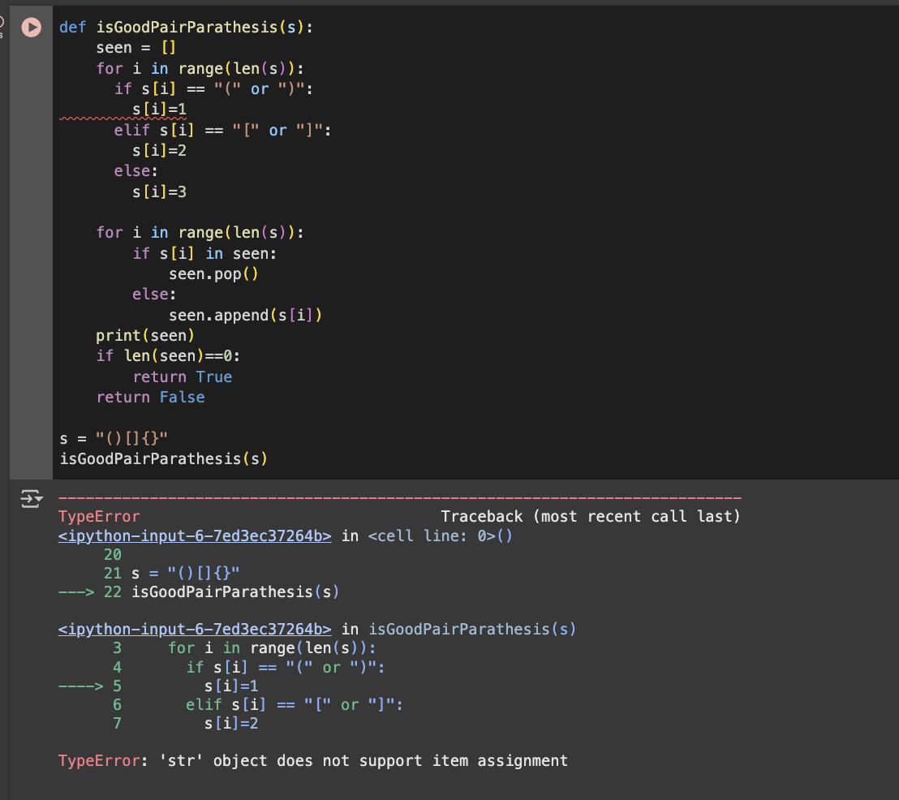
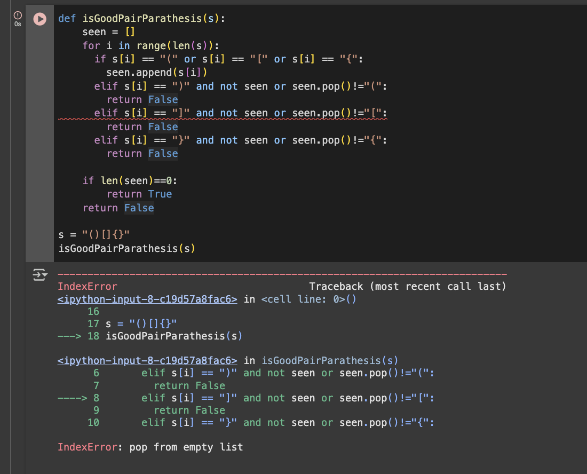
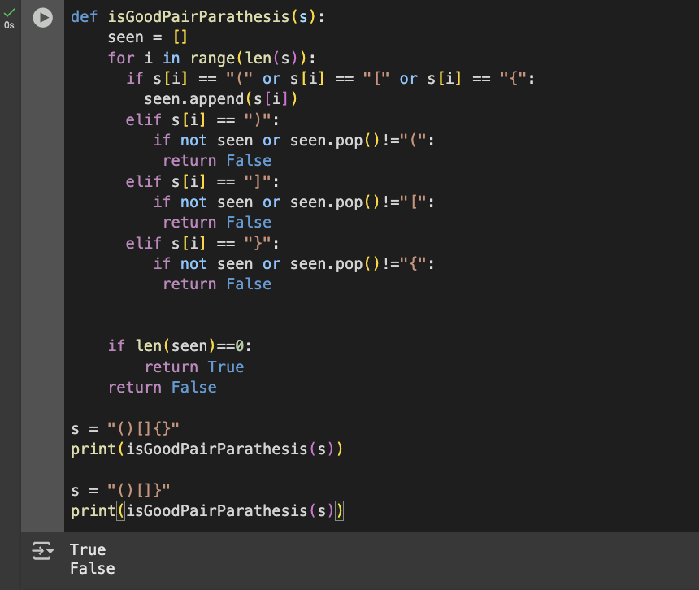
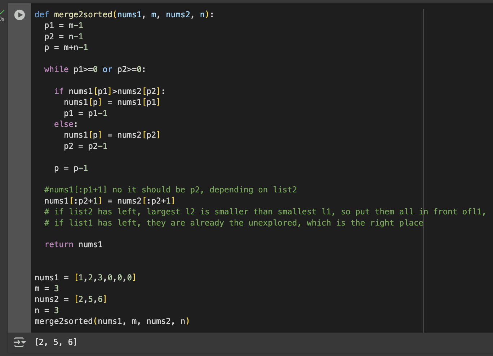

# 算法与数据结构篇：删除排序数组中的重复项

这是一个常见的字节面试算法题，也是 LeetCode 26 题。让我们深入了解这个问题和解决思路。

## 问题描述

给你一个 **升序排列** 的数组 `nums`，请你 **原地** 删除重复出现的元素，使每个元素 **只出现一次**，返回删除后数组的新长度。元素的 **相对顺序** 应该保持 **一致**。

由于在某些语言中不能改变数组的长度，所以必须将结果放在数组 `nums` 的第一部分。更规范地说，如果在删除重复项之后有 `k` 个元素，那么 `nums` 的前 `k` 个元素应该保存最终结果。

## 解题思路

这道题最优解法是**双指针法**，时间复杂度 O(n)，空间复杂度 O(1)。

思路如下：
1. 使用两个指针：
   - `slow` 指针指向处理完成的数组的最后一个位置
   - `fast` 指针用于遍历原数组
2. 比较 `slow` 和 `fast` 指向的元素是否相同
   - 如果不同，将 `slow` 向前移动一步，并将 `fast` 指向的元素复制到 `slow` 位置
   - 如果相同，只移动 `fast` 指针

## 代码实现

Python 实现：
```python
def removeDuplicates(nums):
    if not nums:
        return 0
        
    # 慢指针，指向不重复数组的最后一个位置
    slow = 0
    
    # 快指针，用于遍历整个数组
    for fast in range(1, len(nums)):
        # 如果当前元素与慢指针指向的元素不同
        if nums[fast] != nums[slow]:
            # 移动慢指针
            slow += 1
            # 将当前元素放入慢指针位置
            nums[slow] = nums[fast]
    
    # 返回不重复元素的个数（慢指针位置 + 1）
    return slow + 1
```

JavaScript 实现：
```javascript
function removeDuplicates(nums) {
    if (nums.length === 0) return 0;
    
    let slow = 0;
    
    for (let fast = 1; fast < nums.length; fast++) {
        if (nums[fast] !== nums[slow]) {
            slow++;
            nums[slow] = nums[fast];
        }
    }
    
    return slow + 1;
}
```

## 时间、空间复杂度分析

- **时间复杂度**：O(n)，其中 n 是数组的长度。我们只需要遍历一次数组。
- **空间复杂度**：O(1)，我们只使用了两个指针，没有使用额外的空间。

## 测试用例分析

1. **边界情况**：
   - 空数组：`[]` → 返回 0
   - 只有一个元素：`[1]` → 返回 1

2. **常规情况**：
   - 有重复元素：`[1,1,2]` → 返回 2，修改后的数组为 `[1,2,...]`
   - 有多个重复元素：`[0,0,1,1,1,2,2,3,3,4]` → 返回 5，修改后的数组为 `[0,1,2,3,4,...]`

3. **全部重复元素**：
   - `[1,1,1,1]` → 返回 1，修改后的数组为 `[1,...]`

## 面试注意事项

1. **确认约束**：在开始解题前，确认是否允许使用额外空间、是否需要原地修改等。

2. **清晰解释思路**：解释为什么选择双指针解决此问题，它的优势（空间复杂度低）。

3. **代码细节**：注意处理空数组、单元素数组的边界情况。

4. **验证代码**：手动跟踪一个简单的例子，确保你的算法是正确的。

5. **优化讨论**：可以讨论是否有其他解法（如使用额外数组的方法）及其优缺点。

掌握这个算法题有助于理解双指针技巧，这是解决数组、字符串问题的常用方法，在字节跳动面试中经常出现。

## 我的理解
其实就是重组，如果发现不一样，就代表需要copy这个不一样的东西。边走，边对比，边copy，发现一个不一样，就copy过来，然后往前走

再给我一道题吧


好的，让我给你一道经常在字节跳动测试开发面试中出现的算法题：

# 有效的括号

## 题目描述

给定一个只包括 '('，')'，'{'，'}'，'['，']' 的字符串 s，判断字符串是否有效。

有效字符串需满足：
1. 左括号必须用相同类型的右括号闭合。
2. 左括号必须以正确的顺序闭合。
3. 每个右括号都有一个对应的左括号。

## 示例

```
示例 1：
输入：s = "()"
输出：true

示例 2：
输入：s = "()[]{}"
输出：true

示例 3：
输入：s = "(]"
输出：false

示例 4：
输入：s = "([)]"
输出：false

示例 5：
输入：s = "{[]}"
输出：true
```

## 提示

这道题可以使用栈（stack）这种数据结构来解决。请试着自己实现，然后我们可以讨论你的解法。

思考一下如何使用栈来跟踪括号的匹配关系！



but string is immutable....


should have put it down under elif 




再来一题

很好！你成功解决了括号匹配问题。你的最终代码实现是正确的：使用栈来跟踪左括号，然后在遇到右括号时检查是否匹配。这是解决这类问题的标准方法。

下面是一道新题目，也是字节面试中常见的算法题：

# 合并两个有序数组

## 题目描述

给你两个按 **非递减顺序** 排列的整数数组 `nums1` 和 `nums2`，以及两个整数 `m` 和 `n` ，分别表示 `nums1` 和 `nums2` 中的元素数目。

请你 **原地** 合并 `nums1` 和 `nums2` 为 一个 按 **非递减顺序** 排列的数组。

注意：最终，合并后数组不应由函数返回，而是存储在数组 `nums1` 中。为了应对这种情况，`nums1` 的初始长度为 `m + n`，其中前 `m` 个元素表示应合并的元素，后 `n` 个元素为 0，应忽略。`nums2` 的长度为 `n` 。

## 示例

```
示例 1：
输入：nums1 = [1,2,3,0,0,0], m = 3, nums2 = [2,5,6], n = 3
输出：[1,2,2,3,5,6]
解释：需要合并 [1,2,3] 和 [2,5,6] 。
合并结果是 [1,2,2,3,5,6] ，其中斜体加粗标注的为 nums1 中的元素。

示例 2：
输入：nums1 = [1], m = 1, nums2 = [], n = 0
输出：[1]
解释：需要合并 [1] 和 [] 。
合并结果是 [1] 。

示例 3：
输入：nums1 = [0], m = 0, nums2 = [1], n = 1
输出：[1]
解释：需要合并的数组是 [] 和 [1] 。
合并结果是 [1] 。
注意，因为 m = 0 ，所以 nums1 中没有元素。nums1 中仅存的 0 仅仅是为了确保合并结果可以顺利存放到 nums1 中。
```

## 提示

1. `nums1.length == m + n`
2. `nums2.length == n`
3. `0 <= m, n <= 200`
4. `1 <= m + n <= 200`
5. `-10^9 <= nums1[i], nums2[j] <= 10^9`

尝试思考如何从后向前合并数组，以避免额外的空间开销。



interesting found a bug
should be and not or

我注意到你的代码有个问题，结果显示 `[2, 5, 6]` 而不是期望的 `[1, 2, 2, 3, 5, 6]`。让我们一起排查一下：

问题在于你的 `while` 循环条件使用了 `or` 而不是 `and`。这导致了一个微妙的错误：

```python
while p1>=0 or p2>=0:
```

当使用 `or` 时，如果 `p1` 已经小于0（即 `nums1` 中的有效元素已经处理完），但 `p2` 仍然大于等于0，循环会继续。在这种情况下：

```python
if nums1[p1]>nums2[p2]:
```

会尝试访问 `nums1[-1]`，这在Python中是合法的（它会访问数组的最后一个元素），但这不是我们想要的行为。

正确的方式应该是：

```python
def merge2sorted(nums1, m, nums2, n):
    p1 = m - 1
    p2 = n - 1
    p = m + n - 1
    
    # 先比较两个数组的元素，取较大值放入nums1末尾
    while p1 >= 0 and p2 >= 0:
        if nums1[p1] > nums2[p2]:
            nums1[p] = nums1[p1]
            p1 -= 1
        else:
            nums1[p] = nums2[p2]
            p2 -= 1
        p -= 1
    
    # 如果nums2还有剩余元素，将它们放入nums1前面
    # 如果nums1还有剩余元素，它们已经在正确位置上
    if p2 >= 0:
        nums1[:p2+1] = nums2[:p2+1]
    
    return nums1
```

这样修改后应该能得到正确的结果 `[1, 2, 2, 3, 5, 6]`。

关键是理解：
1. 我们需要先处理两个数组都有元素的情况（用 `and` 连接）
2. 然后单独处理 `nums2` 可能有剩余元素的情况
3. 不需要处理 `nums1` 有剩余元素的情况，因为它们已经在正确位置上

这个问题确实需要仔细思考，尤其是边界条件和指针的处理。不用担心，这类问题多练习几次就会熟悉了！
回顾今天学到的内容，特别是双指针技巧和从后向前处理数组的思路


# 今日学习回顾：双指针技巧与数组处理思路

## 双指针技巧的关键洞察

1. **目的与本质**：
   - 双指针本质上是一种降低时间复杂度的优化手段，通常将O(n²)的解法优化到O(n)
   - 核心思想是利用数据的有序性或其他特征，避免不必要的重复计算

2. **常见双指针模式**：
   - **快慢指针**：在同一个数组上以不同速度移动（如删除排序数组中的重复项）
   - **左右指针**：从数组两端向中间移动（如排序数组的二分查找）
   - **合并指针**：处理两个不同数据源（如合并两个有序数组）

3. **识别应用场景**：
   - 有序数组的操作（查找、合并、删除重复项）
   - 需要原地修改数组
   - 需要在单次遍历中完成任务
   - 涉及链表操作（如检测环、寻找中点）

## 从后向前处理数组的深刻理解

1. **为什么从后向前**：
   - 解决覆盖问题：避免覆盖尚未处理的元素
   - 利用已有空间：尤其适合有预留空间的数组操作
   - 减少移动操作：从前向后处理可能需要频繁移动元素

2. **应用场景与模式识别**：
   - 当数组末尾有足够空间时（如合并有序数组问题）
   - 需要就地排序或合并
   - 涉及插入操作时（从后向前插入减少元素移动）

3. **思维转变**：
   - 把思维从"构建结果"转变为"放置最终元素"
   - 关注元素的最终位置而非初始位置

## 解题策略的整体思考

1. **解题三步法**：
   - **分析约束**：确认空间/时间限制，是否需要原地修改
   - **选择策略**：基于约束选择合适的指针策略
   - **处理边界**：特别关注空数组、单元素数组等边界情况

2. **调试与验证**：
   - 用小型实例手动模拟算法流程
   - 特别关注循环条件和边界处理
   - 验证特殊输入（如数组为空、只有一个元素等）

3. **优化思考**：
   - 代码简洁性：必要时合并条件，减少代码量
   - 通用性：解法是否可以应用于其他类似问题
   - 效率：检查是否有冗余操作

这些技巧不仅适用于面试题，也是实际工作中处理数据的重要思维方式。理解并内化这些模式，将大大提升你解决问题的能力。

## 明日计划
明天我们将讨论 HTTP 与 HTTPS 的区别以及状态码，
明天我们可以聚焦于一些测试开发更常考的知识点，如HTTP基础、测试用例设计等
这是字节跳动测试开发面试中的重要网络知识点。


